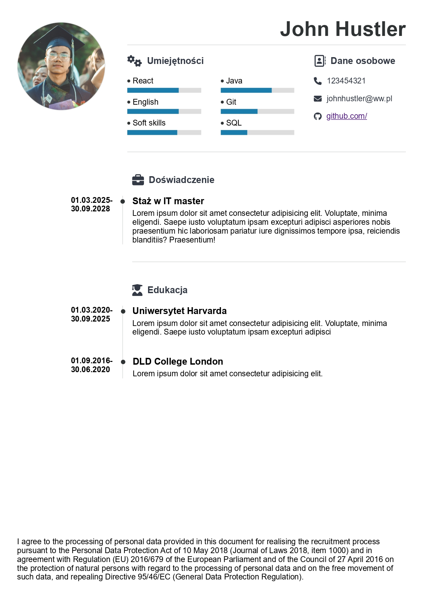

# Cv generator

The CV Generator allows you to quickly create a clear CV and download it as a PDF.

## About the Project

The application is written in React. The styles utilize CSS modules. The state of the application is stored and managed using React's Context and useReducer hooks.

Printing CV to PDF has been implemented using ReactToPrint package.

## Screencast
To see a demonstration of how to use the app, you can watch the following screencast:

## Example CV
Here is an example of a CV created using this app:

